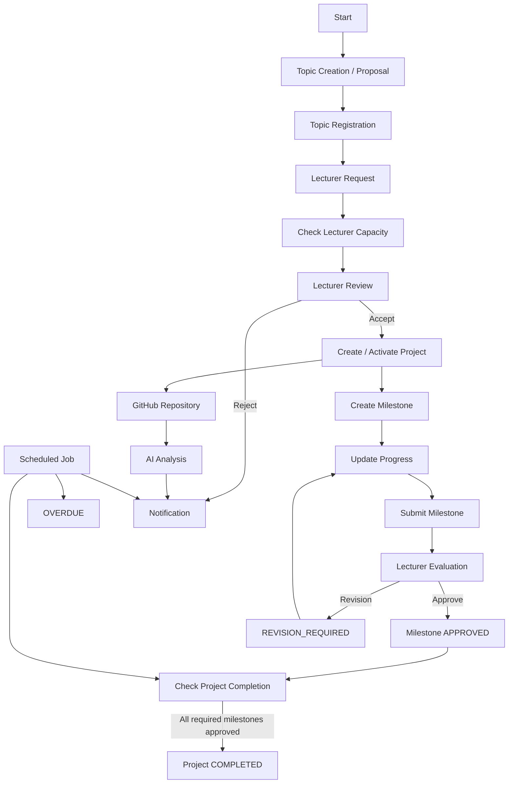

# 7. Business Workflow

## 7.1. Tổng quan

Quy trình của hệ thống quản lý toàn bộ vòng đời của một dự án sinh viên, bắt đầu từ việc hình thành đề tài, đăng ký giảng viên hướng dẫn, thực hiện dự án, quản lý milestone, đánh giá kết quả và hoàn thành Project.

Quy trình tổng quát:

```text
Tạo / Đề xuất Topic
        ↓
Đăng ký Topic
        ↓
Đăng ký Lecturer
        ↓
Kiểm tra Lecturer Capacity
        ↓
Lecturer Accept
        ↓
Create Project
        ↓
Tạo Milestone
        ↓
Student thực hiện
        ↓
Cập nhật Progress
        ↓
Submit Milestone
        ↓
Lecturer Review
        ↓
   ┌───────────────┐
   │               │
 APPROVED    REVISION_REQUIRED
   │               │
   │               ↓
   │          Student sửa
   │               │
   │               ↓
   │            Submit
   │               │
   └───────←───────┘
        ↓
Tất cả Milestone hoàn thành
        ↓
Lecturer xác nhận
        ↓
Project COMPLETED
```

---

## 7.2. Tạo và đăng ký đề tài

Hệ thống hỗ trợ hai cách hình thành đề tài.

### 7.2.1. Cách 1: Đề tài có sẵn

Đề tài có thể được tạo bởi Admin hoặc Lecturer.

Quy trình:

1. Admin hoặc Lecturer tạo Topic.
2. Topic được mở cho Student đăng ký.
3. Student xem danh sách Topic.
4. Student xem thông tin chi tiết của Topic.
5. Student đăng ký Topic.
6. Hệ thống ghi nhận yêu cầu đăng ký.
7. Student tiếp tục chọn Lecturer hướng dẫn.

```text
Admin / Lecturer
       ↓
Create Topic
       ↓
Open Registration
       ↓
Student xem Topic
       ↓
Student đăng ký Topic
       ↓
Lecturer Registration
```

---

### 7.2.2. Cách 2: Student tự đề xuất Topic

Student có thể tự đề xuất một Topic mới.

Quy trình:

1. Student tạo Topic Proposal.
2. Student gửi Proposal.
3. Proposal chuyển sang trạng thái `PENDING_APPROVAL`.
4. Lecturer xem và kiểm tra Proposal.
5. Lecturer đưa ra quyết định.

Nếu được chấp nhận:

```text
PENDING_APPROVAL
        ↓
     APPROVED
        ↓
Student tiếp tục đăng ký Lecturer
```

Nếu bị từ chối:

```text
PENDING_APPROVAL
        ↓
      REJECTED
        ↓
Student chỉnh sửa
        ↓
     Resubmit
        ↓
PENDING_APPROVAL
```

Khi từ chối Proposal, Lecturer phải cung cấp lý do để Student biết nội dung cần chỉnh sửa.

---

## 7.3. Đăng ký Lecturer

Sau khi Student đã có Topic, Student có thể gửi yêu cầu Lecturer hướng dẫn.

Quy trình:

1. Student chọn Lecturer.
2. Student gửi Lecturer Request.
3. Hệ thống kiểm tra Capacity của Lecturer.
4. Nếu Lecturer đã đủ số lượng sinh viên, hệ thống không cho phép vượt quá Capacity.
5. Nếu còn chỗ, Request được tạo với trạng thái `PENDING`.
6. Lecturer xem Request.
7. Lecturer đưa ra quyết định.

### Trường hợp Accept

```text
PENDING
   ↓
ACCEPTED
   ↓
Create / Activate Project
```

### Trường hợp Reject

```text
PENDING
   ↓
REJECTED
   ↓
Lecturer nhập lý do
   ↓
Student nhận Notification
```

Hệ thống phải thực hiện kiểm tra Capacity ở phía Server tại thời điểm xử lý Request.

Việc kiểm tra và cập nhật Capacity cần bảo đảm tính nhất quán khi có nhiều Request được xử lý đồng thời.

---

## 7.4. Quản lý Project

Sau khi Topic và Lecturer được xác nhận:

1. Hệ thống tạo hoặc kích hoạt Project.
2. Project có trạng thái phù hợp với vòng đời của hệ thống.
3. Project chuyển sang `IN_PROGRESS` khi bắt đầu thực hiện.
4. Lecturer tạo các Milestone.
5. Mỗi Milestone có:
   - Tên.
   - Mô tả.
   - Deadline.
   - Yêu cầu kết quả.
   - Trạng thái.
6. Student thực hiện Milestone.
7. Student cập nhật Progress.
8. Student Submit kết quả.
9. Lecturer Review kết quả.

Project có các trạng thái chính:

```text
DRAFT
  ↓
REGISTERED
  ↓
IN_PROGRESS
  ↓
COMPLETED
```

Project có thể chuyển sang:

```text
IN_PROGRESS
      ↓
   CANCELLED
```

`REJECTED` không phải là trạng thái của Project. Trạng thái `REJECTED` được sử dụng cho các Request hoặc Topic Proposal.

---

## 7.5. Quản lý Milestone

Mỗi Project có thể có nhiều Milestone.

Trạng thái Milestone:

```text
PENDING
   ↓
IN_PROGRESS
   ↓
SUBMITTED
   ↓
APPROVED
```

Nếu Lecturer yêu cầu chỉnh sửa:

```text
SUBMITTED
   ↓
REVISION_REQUIRED
   ↓
IN_PROGRESS
   ↓
SUBMITTED
   ↓
APPROVED
```

Nếu Student chưa hoàn thành Milestone và quá Deadline:

```text
IN_PROGRESS
      ↓
   OVERDUE
```

Sau khi tiếp tục thực hiện:

```text
OVERDUE
   ↓
SUBMITTED
   ↓
Lecturer Review
```

Deadline là một thuộc tính thời gian của Milestone và không phải là một trạng thái riêng.

---

## 7.6. Cập nhật Progress

Student có trách nhiệm cập nhật tiến độ thực hiện Project.

Quy trình:

1. Student mở Project.
2. Student chọn Milestone.
3. Student cập nhật Progress.
4. Student có thể cập nhật nội dung thực hiện.
5. Student có thể cập nhật kết quả.
6. Hệ thống lưu lại thông tin Progress.
7. Lecturer có thể theo dõi Progress.

Progress có thể được sử dụng để hiển thị trên Dashboard.

```text
Student
   ↓
Select Project
   ↓
Select Milestone
   ↓
Update Progress
   ↓
Save Progress
   ↓
Lecturer theo dõi
```

---

## 7.7. Submit và Evaluation

Sau khi hoàn thành Milestone, Student Submit kết quả.

```text
Student
   ↓
Submit Milestone
   ↓
SUBMITTED
   ↓
Lecturer Review
```

Lecturer có hai lựa chọn:

### Trường hợp 1: Approve

```text
SUBMITTED
   ↓
APPROVED
```

Milestone được xem là hoàn thành.

### Trường hợp 2: Revision

```text
SUBMITTED
   ↓
REVISION_REQUIRED
   ↓
Lecturer nhập yêu cầu chỉnh sửa
   ↓
Student nhận Notification
   ↓
Student chỉnh sửa
   ↓
IN_PROGRESS
   ↓
Submit lại
```

Lecturer tiếp tục đánh giá sau khi Student Submit lại.

---

## 7.8. Hoàn thành Project

Project không được tự động chuyển sang `COMPLETED` chỉ vì tất cả Milestone đã được Submit.

Điều kiện để Project đủ điều kiện hoàn thành:

- Tất cả Milestone bắt buộc đã ở trạng thái `APPROVED`.
- Không còn Milestone cần chỉnh sửa.
- Các kết quả cần thiết đã được cập nhật.
- Lecturer xác nhận hoàn thành Project.

Quy trình:

```text
All Required Milestones
        ↓
     APPROVED
        ↓
Project đủ điều kiện hoàn thành
        ↓
Lecturer xác nhận
        ↓
    COMPLETED
```

Scheduled Job có thể kiểm tra điều kiện hoàn thành nhưng không thay thế quyết định xác nhận cuối cùng của Lecturer.

---

## 7.9. GitHub Integration

Student có thể liên kết GitHub Repository với Project.

Quy trình:

1. Student chọn Project.
2. Student liên kết GitHub Repository.
3. Hệ thống lưu thông tin Repository.
4. Hệ thống có thể lấy thông tin Repository khi cần.
5. Lecturer có thể xem Repository của Project.
6. Source code có thể được sử dụng cho AI Analysis.

```text
Student
   ↓
Link GitHub Repository
   ↓
Project
   ↓
GitHub Repository
   ↓
Source Code
```

---

## 7.10. AI Code Analysis

AI Analysis là chức năng hỗ trợ phân tích source code.

Quy trình:

1. Project đã được liên kết với GitHub Repository.
2. Hệ thống lấy source code cần phân tích.
3. Source code được gửi đến AI Analysis Service.
4. AI thực hiện phân tích.
5. Hệ thống lưu kết quả phân tích.
6. Lecturer xem AI Analysis Report.
7. Lecturer sử dụng kết quả AI như một nguồn thông tin hỗ trợ.
8. Lecturer đưa ra đánh giá cuối cùng.

```text
GitHub Repository
        ↓
   Source Code
        ↓
AI Analysis Service
        ↓
AI Analysis Report
        ↓
Lecturer
        ↓
Final Evaluation
```

AI không tự động thay thế quyết định đánh giá của Lecturer.

---

## 7.11. Notification

Hệ thống gửi Notification khi xảy ra các sự kiện quan trọng.

Các sự kiện có thể tạo Notification:

- Student gửi Lecturer Request.
- Lecturer Accept Request.
- Lecturer Reject Request.
- Topic Proposal được Approve.
- Topic Proposal bị Reject.
- Milestone được tạo.
- Deadline sắp đến.
- Milestone quá hạn.
- Lecturer yêu cầu Revision.
- AI Analysis hoàn thành.
- Project có thay đổi trạng thái quan trọng.

Ví dụ:

```text
Lecturer Reject Request
        ↓
Create Notification
        ↓
Student
        ↓
Xem lý do Reject
```

Hệ thống cần hạn chế việc tạo Notification trùng lặp cho cùng một sự kiện.

---

## 7.12. Automation

Scheduled Job được thực hiện định kỳ để kiểm tra các sự kiện cần tự động xử lý.

Các nhiệm vụ chính:

- Kiểm tra Deadline của Milestone.
- Gửi Reminder trước Deadline.
- Gửi Warning khi gần đến Deadline.
- Kiểm tra Milestone quá hạn.
- Cập nhật Milestone thành `OVERDUE` khi phù hợp.
- Tạo Notification.
- Kiểm tra điều kiện hoàn thành Project.
- Ghi log khi Automation xảy ra lỗi.

### Quy tắc Deadline

Ví dụ:

```text
7 ngày trước Deadline
        ↓
Reminder

3 ngày trước Deadline
        ↓
Warning

Đến Deadline
        ↓
Check Milestone

Quá Deadline + chưa Submit
        ↓
OVERDUE
```

Chỉ Milestone phù hợp mới được tự động chuyển thành `OVERDUE`.

Các trạng thái sau không được Scheduled Job tự động chuyển thành `OVERDUE`:

- `SUBMITTED`
- `REVISION_REQUIRED`
- `APPROVED`

`SUBMITTED` phải chờ Lecturer Review.

`REVISION_REQUIRED` cần Student thực hiện chỉnh sửa.

`APPROVED` đã hoàn thành.

---

## 7.13. Tổng quan toàn bộ Business Workflow



---

## 7.14. Business Rules chính

| Rule | Mô tả |
|---|---|
| BR-01 | Student chỉ được truy cập các chức năng phù hợp với quyền Student. |
| BR-02 | Lecturer chỉ được quản lý các Project và Topic thuộc phạm vi được phân công. |
| BR-03 | Admin có quyền quản lý và giám sát dữ liệu hệ thống. |
| BR-04 | Lecturer không được nhận thêm Student khi đã đạt Capacity. |
| BR-05 | Capacity phải được kiểm tra ở phía Server. |
| BR-06 | Lecturer Request chỉ được Accept khi còn Capacity phù hợp. |
| BR-07 | Topic Proposal bị Reject phải có lý do. |
| BR-08 | Lecturer Request bị Reject phải có lý do. |
| BR-09 | Milestone chỉ được APPROVED sau khi Lecturer đánh giá. |
| BR-10 | Student có thể Submit lại Milestone sau khi được yêu cầu Revision. |
| BR-11 | Chỉ Milestone chưa hoàn thành phù hợp mới có thể chuyển thành OVERDUE. |
| BR-12 | `SUBMITTED` không được tự động chuyển thành `OVERDUE`. |
| BR-13 | Project chỉ được COMPLETED sau khi tất cả Milestone bắt buộc APPROVED và Lecturer xác nhận. |
| BR-14 | AI chỉ cung cấp thông tin hỗ trợ và không thay thế Lecturer trong đánh giá cuối cùng. |
| BR-15 | Notification không được tạo trùng cho cùng một sự kiện. |
| BR-16 | Các tác vụ Automation phải ghi log khi xảy ra lỗi. |

---

## 7.15. Kết luận

Business Workflow mô tả toàn bộ vòng đời của một Project từ khi hình thành Topic cho đến khi Project hoàn thành.

Quy trình được chia thành các nhóm chính:

1. Topic Management.
2. Topic Registration.
3. Lecturer Registration.
4. Lecturer Capacity Management.
5. Project Management.
6. Milestone Management.
7. Progress Management.
8. Evaluation.
9. GitHub Integration.
10. AI Code Analysis.
11. Notification.
12. Automation.

Workflow này là cơ sở để xây dựng Use Case, thiết kế Database, thiết kế API và triển khai các module của hệ thống.
