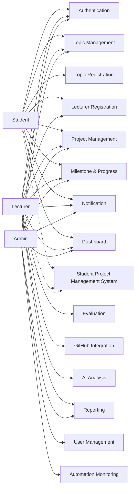
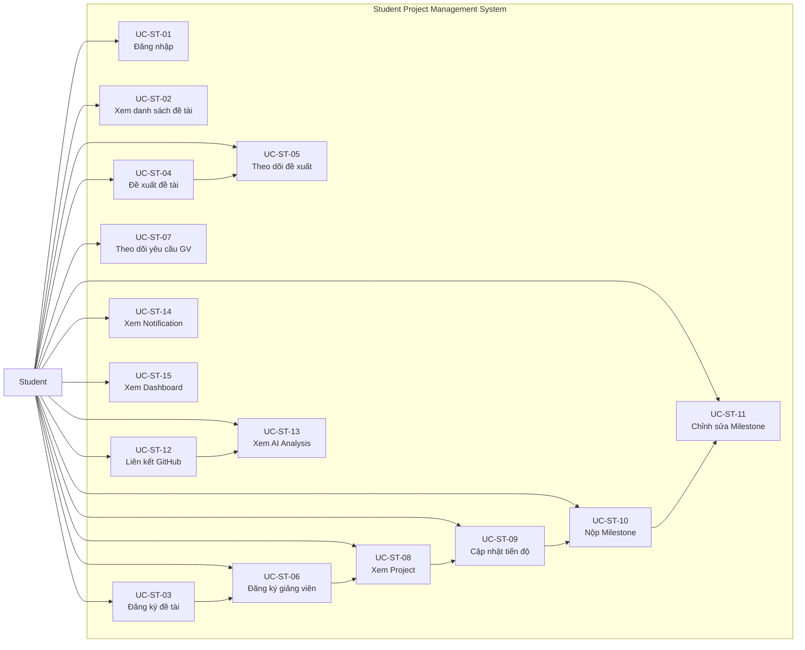
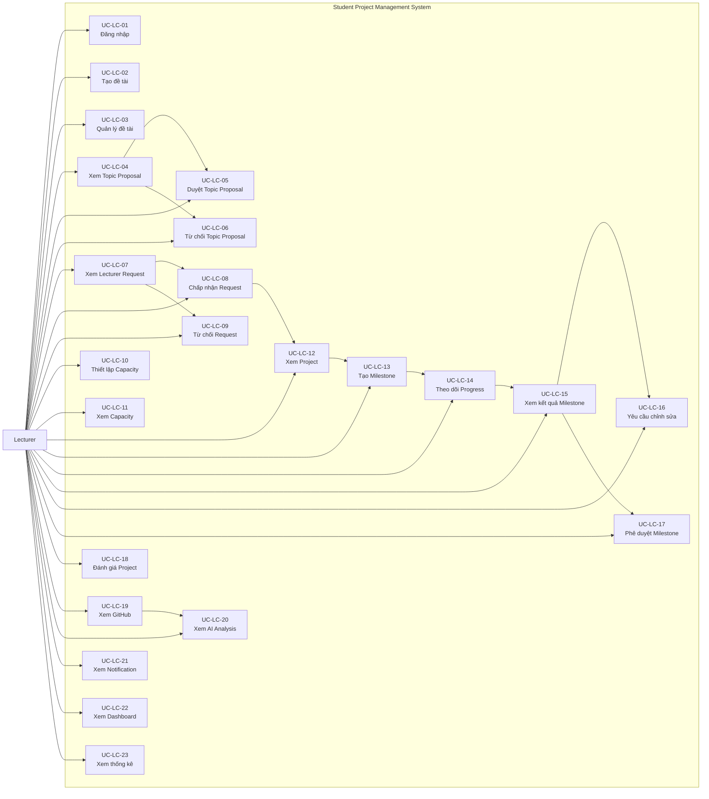
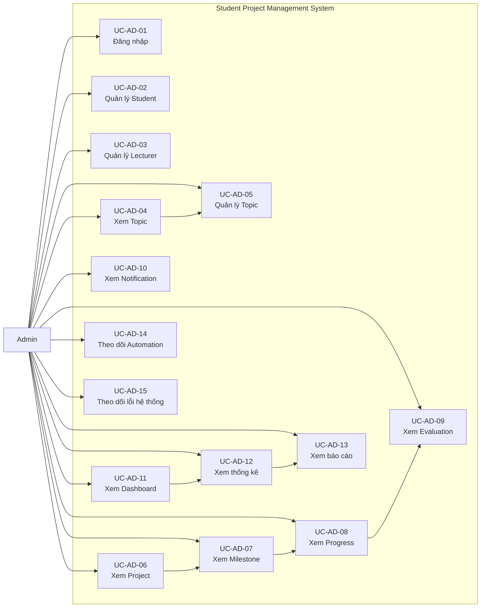
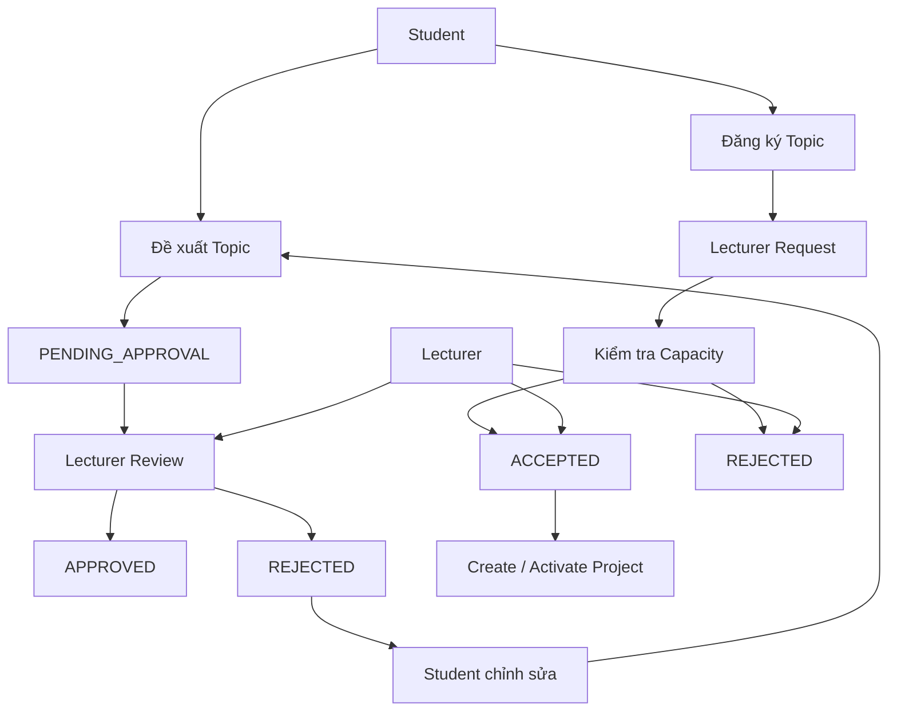
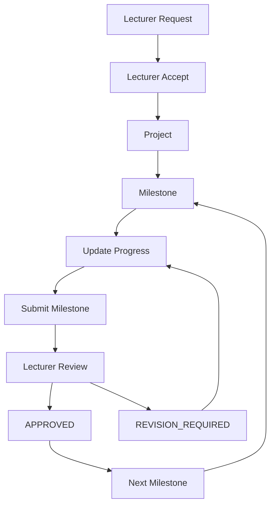
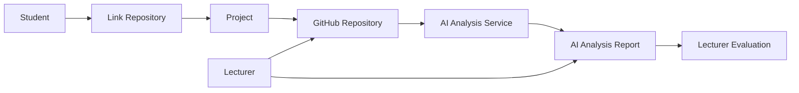
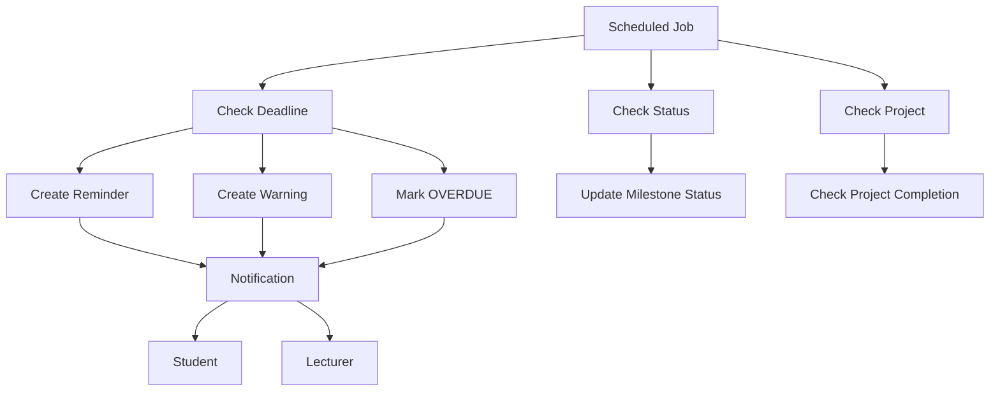

# 16. Use Case Diagrams

## 16.1 Mục tiêu

Use Case Diagram được xây dựng nhằm mô tả trực quan các chức năng chính của hệ thống quản lý đề tài và theo dõi tiến độ dự án sinh viên.

Use Case Diagram giúp:

- Xác định các Actor tương tác với hệ thống.
- Xác định phạm vi chức năng của hệ thống.
- Thể hiện mối quan hệ giữa Actor và Use Case.
- Làm cơ sở cho thiết kế kiến trúc, API và giao diện.
- Hỗ trợ quá trình triển khai và kiểm thử hệ thống.

Hệ thống có ba Actor chính:

- Student
- Lecturer
- Admin

Ngoài ra, hệ thống có các thành phần hỗ trợ:

- Scheduled Job
- GitHub
- AI Analysis Service

---

## 16.2 Tổng quan hệ thống

Hệ thống quản lý toàn bộ vòng đời của một đề tài sinh viên:

```text
Đăng nhập
   ↓
Quản lý đề tài
   ↓
Đăng ký đề tài / Đề xuất đề tài
   ↓
Đăng ký giảng viên
   ↓
Kiểm tra Capacity
   ↓
Tạo Project
   ↓
Tạo Milestone
   ↓
Sinh viên cập nhật tiến độ
   ↓
Nộp kết quả
   ↓
Giảng viên đánh giá
   ↓
APPROVED / REVISION_REQUIRED
   ↓
Hoàn thành Project
```

GitHub và AI Analysis được tích hợp vào giai đoạn thực hiện Project.

Scheduled Job chịu trách nhiệm kiểm tra deadline, cập nhật trạng thái và tạo notification tự động.

---

## 16.3 System Boundary

System Boundary của hệ thống bao gồm các nhóm chức năng:

1. Authentication & Authorization
2. User Management
3. Topic Management
4. Registration Management
5. Lecturer Capacity
6. Project Management
7. Milestone Management
8. Progress Management
9. Evaluation
10. GitHub Integration
11. AI Analysis
12. Notification
13. Automation
14. Dashboard & Reporting

Các hệ thống bên ngoài như GitHub và AI Analysis Service tương tác với hệ thống thông qua các chức năng tích hợp tương ứng.

---

## 16.4 Use Case Diagram tổng quan



---

## 16.5 Student Use Case Diagram

Student là người thực hiện Project và cập nhật tiến độ.

Các chức năng chính:

- Đăng nhập.
- Xem danh sách đề tài.
- Đăng ký đề tài.
- Đề xuất đề tài.
- Theo dõi trạng thái đề xuất.
- Gửi yêu cầu đăng ký giảng viên.
- Theo dõi yêu cầu đăng ký giảng viên.
- Xem Project.
- Cập nhật tiến độ.
- Nộp kết quả Milestone.
- Chỉnh sửa Milestone khi được yêu cầu.
- Liên kết GitHub Repository.
- Xem kết quả AI Analysis.
- Xem Notification.
- Xem Dashboard.



---

## 16.6 Lecturer Use Case Diagram

Lecturer chịu trách nhiệm quản lý đề tài, tiếp nhận sinh viên, quản lý Project và đánh giá kết quả.

Các chức năng chính:

- Đăng nhập.
- Tạo đề tài.
- Quản lý đề tài.
- Xem và duyệt Topic Proposal.
- Xem và xử lý Lecturer Request.
- Thiết lập Capacity.
- Xem Capacity.
- Xem Project.
- Tạo Milestone.
- Theo dõi Progress.
- Xem kết quả Milestone.
- Yêu cầu chỉnh sửa.
- Phê duyệt Milestone.
- Đánh giá Project.
- Xem GitHub Repository.
- Xem AI Analysis.
- Xem Notification.
- Xem Dashboard.
- Xem thống kê.



---

## 16.7 Admin Use Case Diagram

Admin chịu trách nhiệm quản lý dữ liệu và giám sát hoạt động của hệ thống.

Các chức năng chính:

- Đăng nhập.
- Quản lý Student.
- Quản lý Lecturer.
- Xem và quản lý Topic.
- Xem Project.
- Xem Milestone.
- Xem Progress.
- Xem Evaluation.
- Xem Notification.
- Xem Dashboard.
- Xem thống kê.
- Xem báo cáo hệ thống.
- Theo dõi Automation.
- Theo dõi lỗi hệ thống.



---

## 16.8 Topic và Registration Use Case

Quá trình hình thành Project có thể bắt đầu theo hai hướng:

### Trường hợp 1: Sinh viên đăng ký đề tài có sẵn

```text
Student
   ↓
Xem danh sách Topic
   ↓
Đăng ký Topic
   ↓
Hệ thống ghi nhận Registration
   ↓
Đăng ký Lecturer
   ↓
Kiểm tra Lecturer Capacity
   ↓
Lecturer Accept / Reject
```

### Trường hợp 2: Sinh viên tự đề xuất đề tài

```text
Student
   ↓
Đề xuất Topic
   ↓
PENDING_APPROVAL
   ↓
Lecturer xem Proposal
   ↓
      ┌───────────────┐
      │               │
   APPROVED        REJECTED
      │               │
      ↓               ↓
Đăng ký Lecturer    Chỉnh sửa
                      │
                      ↓
                   Resubmit
```

Use Case relationship:



---

## 16.9 Project và Milestone Use Case

Sau khi Lecturer chấp nhận yêu cầu đăng ký, hệ thống tạo hoặc kích hoạt Project.

Lecturer có thể tạo nhiều Milestone cho Project.

Student thực hiện từng Milestone và cập nhật tiến độ.



---

## 16.10 GitHub và AI Analysis

GitHub và AI Analysis là các chức năng mở rộng của hệ thống.

Student liên kết Repository với Project.

Lecturer có thể xem Repository.

AI Analysis Service lấy source code từ Repository và thực hiện phân tích.

AI chỉ cung cấp kết quả hỗ trợ. Lecturer vẫn là người chịu trách nhiệm đánh giá cuối cùng.



---

## 16.11 Notification và Automation

Automation được thực hiện bởi Scheduled Job.

Scheduled Job định kỳ kiểm tra:

- Deadline Milestone.
- Milestone quá hạn.
- Trạng thái Project.
- Các sự kiện cần tạo Notification.



Các sự kiện khác như Lecturer Accept/Reject Request hoặc Lecturer yêu cầu chỉnh sửa Milestone có thể tạo Notification theo cơ chế event-driven thay vì chờ Scheduled Job.

---

## 16.12 Mapping Actor và Use Case

| Actor | Nhóm chức năng | Use Case |
|---|---|---|
| Student | Authentication | UC-ST-01 |
| Student | Topic | UC-ST-02 → UC-ST-05 |
| Student | Lecturer Registration | UC-ST-06 → UC-ST-07 |
| Student | Project | UC-ST-08 |
| Student | Progress | UC-ST-09 → UC-ST-11 |
| Student | GitHub | UC-ST-12 |
| Student | AI | UC-ST-13 |
| Student | Notification | UC-ST-14 |
| Student | Dashboard | UC-ST-15 |
| Lecturer | Authentication | UC-LC-01 |
| Lecturer | Topic | UC-LC-02 → UC-LC-06 |
| Lecturer | Registration | UC-LC-07 → UC-LC-09 |
| Lecturer | Capacity | UC-LC-10 → UC-LC-11 |
| Lecturer | Project | UC-LC-12 |
| Lecturer | Milestone | UC-LC-13 → UC-LC-17 |
| Lecturer | Evaluation | UC-LC-18 |
| Lecturer | GitHub | UC-LC-19 |
| Lecturer | AI | UC-LC-20 |
| Lecturer | Notification | UC-LC-21 |
| Lecturer | Dashboard | UC-LC-22 |
| Lecturer | Reporting | UC-LC-23 |
| Admin | Authentication | UC-AD-01 |
| Admin | User Management | UC-AD-02 → UC-AD-03 |
| Admin | Topic | UC-AD-04 → UC-AD-05 |
| Admin | Project | UC-AD-06 |
| Admin | Milestone | UC-AD-07 |
| Admin | Progress | UC-AD-08 |
| Admin | Evaluation | UC-AD-09 |
| Admin | Notification | UC-AD-10 |
| Admin | Dashboard | UC-AD-11 |
| Admin | Statistics | UC-AD-12 |
| Admin | Reporting | UC-AD-13 |
| Admin | Automation | UC-AD-14 → UC-AD-15 |

---

## 16.13 Các thành phần hỗ trợ

### Scheduled Job

Scheduled Job không phải là người dùng trực tiếp mà là thành phần thực thi tự động.

Nhiệm vụ:

- Kiểm tra deadline.
- Cập nhật Milestone thành OVERDUE khi phù hợp.
- Tạo Notification.
- Kiểm tra trạng thái Project.
- Ghi log lỗi Automation.

### GitHub

GitHub là hệ thống bên ngoài cung cấp Repository cho Project.

Hệ thống có thể sử dụng GitHub để:

- Lưu source code.
- Liên kết Repository với Project.
- Lấy thông tin Repository.
- Hỗ trợ AI Analysis.

### AI Analysis Service

AI Analysis Service nhận source code và tạo báo cáo phân tích.

Kết quả AI có thể hỗ trợ Lecturer xem:

- Cấu trúc source code.
- Một số vấn đề trong code.
- Chất lượng code.
- Một số chỉ số hoặc nhận xét kỹ thuật.

AI không tự động thay thế quyết định đánh giá cuối cùng của Lecturer.

---

## 16.14 Quan hệ giữa các nhóm Use Case

Các nhóm Use Case chính có quan hệ theo chuỗi:

```text
Authentication
      ↓
Topic Management
      ↓
Registration Management
      ↓
Lecturer Capacity
      ↓
Project Management
      ↓
Milestone Management
      ↓
Progress Management
      ↓
Evaluation
      ↓
Project Completion
```

Các chức năng hỗ trợ:

```text
Project
 ├── GitHub Integration
 │       ↓
 │   AI Analysis
 │
 ├── Notification
 │
 ├── Dashboard
 │
 └── Reporting
```

Automation hoạt động xuyên suốt vòng đời:

```text
Scheduled Job
      ↓
Deadline / Status Checking
      ↓
Milestone / Project Status
      ↓
Notification
```

---

## 16.15 Nguyên tắc xây dựng Use Case Diagram

1. Mỗi Actor chỉ được kết nối với những Use Case mà Actor đó có quyền thực hiện.

2. Không cho phép Student thực hiện các chức năng quản trị hệ thống.

3. Lecturer có quyền quản lý đề tài của mình và đánh giá Project được phân công.

4. Admin có quyền quản lý và giám sát dữ liệu hệ thống.

5. Capacity của Lecturer phải được kiểm tra ở phía Server.

6. Việc Accept Lecturer Request cần đảm bảo tính nhất quán dữ liệu khi có nhiều request đồng thời.

7. AI Analysis chỉ đóng vai trò hỗ trợ phân tích.

8. Lecturer vẫn là người đánh giá cuối cùng.

9. Scheduled Job thực hiện các tác vụ định kỳ và không thay thế thao tác nghiệp vụ của người dùng.

10. Deadline là thuộc tính thời gian của Milestone, không phải một trạng thái riêng.

---

## 16.16 Mapping với Functional Requirements

Use Case Diagram được xây dựng dựa trên các Functional Requirements đã xác định:

| Functional Requirement | Use Case liên quan |
|---|---|
| FR-01 Authentication | UC-ST-01, UC-LC-01, UC-AD-01 |
| FR-02 Authorization | Tất cả Use Case |
| FR-03 Student Management | UC-AD-02 |
| FR-04 Lecturer Management | UC-AD-03, UC-LC-10 |
| FR-05 Lecturer Capacity | UC-LC-10, UC-LC-11 |
| FR-06 Topic Management | UC-ST-02, UC-ST-04, UC-LC-02 → UC-LC-06 |
| FR-07 Topic Registration | UC-ST-03 |
| FR-08 Lecturer Request | UC-ST-06 |
| FR-09 Accept / Reject Request | UC-LC-08, UC-LC-09 |
| FR-10 Capacity Enforcement | UC-LC-08 |
| FR-11 Project Management | UC-ST-08, UC-LC-12 |
| FR-12 Milestone Management | UC-LC-13 |
| FR-13 Progress | UC-ST-09 |
| FR-14 Evaluation | UC-LC-15 → UC-LC-18 |
| FR-15 GitHub | UC-ST-12, UC-LC-19 |
| FR-16 AI Analysis | UC-ST-13, UC-LC-20 |
| FR-17 Notification | UC-ST-14, UC-LC-21, UC-AD-10 |
| FR-18 Scheduled Deadline Checking | UC-AD-14 |
| FR-19 Automatic Status Update | UC-AD-14 |
| FR-20 Progress Dashboard | UC-ST-15, UC-LC-22, UC-AD-11 |
| FR-21 Statistics / Reporting | UC-LC-23, UC-AD-12, UC-AD-13 |

---

## 16.17 Kết luận

Use Case Diagram mô tả toàn bộ phạm vi chức năng của hệ thống quản lý đề tài và theo dõi tiến độ dự án sinh viên.

Ba Actor chính gồm:

- Student: thực hiện và theo dõi Project.
- Lecturer: quản lý đề tài, hướng dẫn và đánh giá Project.
- Admin: quản lý và giám sát hệ thống.

Các thành phần GitHub, AI Analysis Service và Scheduled Job đóng vai trò hỗ trợ cho quá trình quản lý Project và tự động hóa.

Use Case Diagram là cơ sở để chuyển sang các bước thiết kế tiếp theo, bao gồm:

- Thiết kế kiến trúc hệ thống.
- Thiết kế Database và ERD.
- Thiết kế API.
- Thiết kế Backend.
- Thiết kế Frontend.
- Thiết kế Automation.
- Thiết kế GitHub Integration và AI Analysis.
