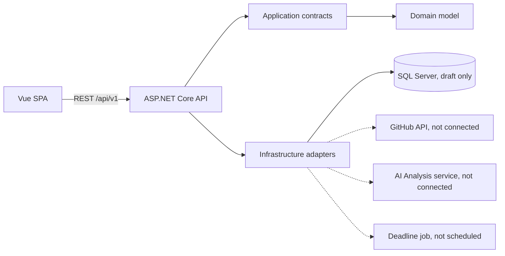

# Architecture (proposed scaffold, not yet a final approved design)

The Week 2 document defines use cases and supporting actors, but an Architecture Diagram, ERD and Class Diagram belong to Week 3; therefore all field and transport choices here are **proposals for further review**, not claims that they were already approved.

API modules: auth, users/students, lecturers & capacity, topics & proposals, topic registrations, lecturer requests, registration periods, projects, milestones, progress, submissions, evaluations, repositories, AI reports, notifications, automation, dashboard, statistics/reports, audit & system monitoring, configuration.

API endpoints declare their future method/path and access-role boundary. Each one is deliberately an explicit 501 stub, never a success mock. Frontend role switching is local to the preview shell and does not grant backend access.

### Planned sequence after approval
1. Finalize ERD, ownership and uniqueness rules; generate EF Core migrations.
2. Implement credentials, hashed passwords, token issuance and AuthN/AuthZ tests.
3. Add transactional capacity acceptance and topic/lecturer requests (include concurrent request tests).
4. Implement projects, milestones, submissions and lecturer approvals.
5. Add scheduled jobs, notification delivery, GitHub API and async AI analysis pipeline.
6. Add role-wise API/UI integration tests and monitoring.

## Week 3 update (provisional)

Database mappings for 21 tables have been added to `StudentProjectsDbContext` (foreign keys, lengths, indexes, check constraints and per-period lecturer capacity). See [`ERD.md`](ERD.md) and [`CLASS-DIAGRAM.md`](CLASS-DIAGRAM.md). The API startup/health endpoint and 501 placeholders **do not change**. No DB is instantiated or migrated at startup. Full compilation with the .NET 10 SDK and SQL Server integration tests remain required before treating the schema as verified.

## Auth v0.3 implementation delta

Auth is now functional (Users -> Roles, PasswordHasher, JWT, GET /auth/me, POST /auth/logout revokes account tokens). Backend role policies continue to protect the other 501 stubs; frontend no longer uses preview-role switching. SQL Server LocalDB migration needs to be generated/applied on the Windows host. See `AUTH-IMPLEMENTATION.md`. Earlier references to 501-only auth apply to v0.2 and earlier.
