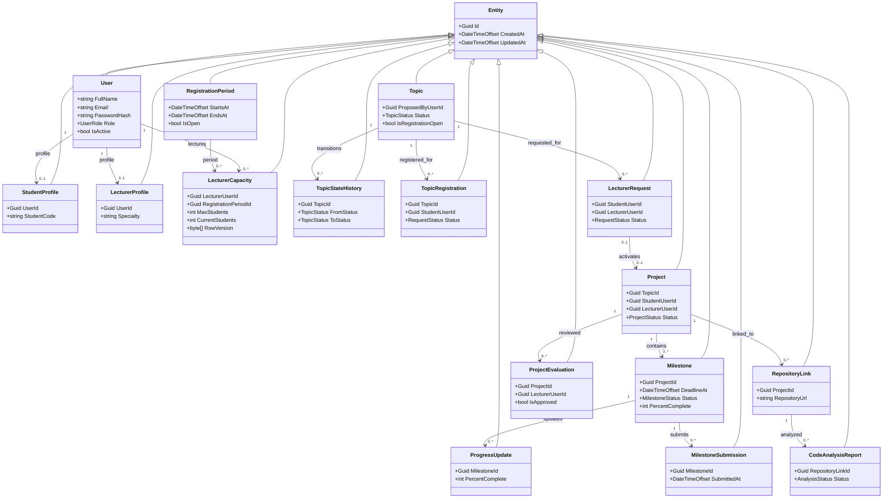

# Week 3 | Class Diagram (mô hình domain ở mức thiết kế)

Các class bên dưới đã được khai báo trong `StudentProjects.Domain/Entities/CoreEntities.cs`. Đường liên hệ mô tả FK, **không** biểu thị navigation property C# hiện hữu. Vì vậy sơ đồ phản ánh logical model, không khẳng định đầy đủ phương thức nghiệp vụ.

Các class vận hành `Notification`, `AutomationRun`, `AuditEntry`, `SystemError`, `SystemSetting` vẫn thuộc domain và được biểu diễn ở ERD. Phương thức Application service (ví dụ `AcceptLecturerRequest`) **chưa được code**; không thêm method giả vào class diagram.
