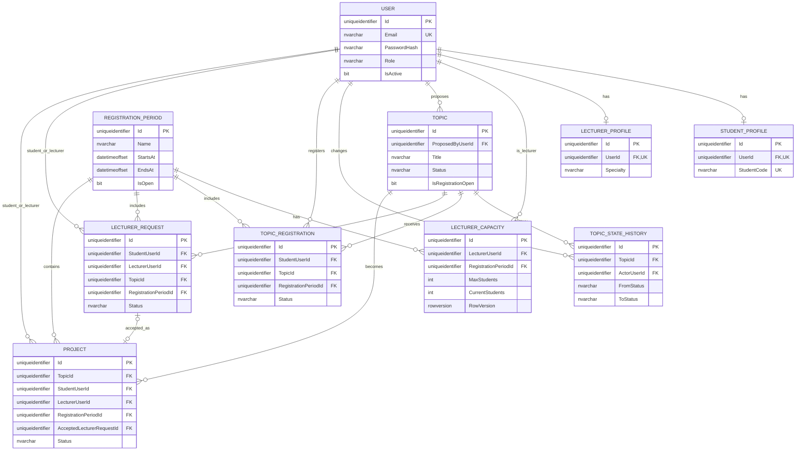
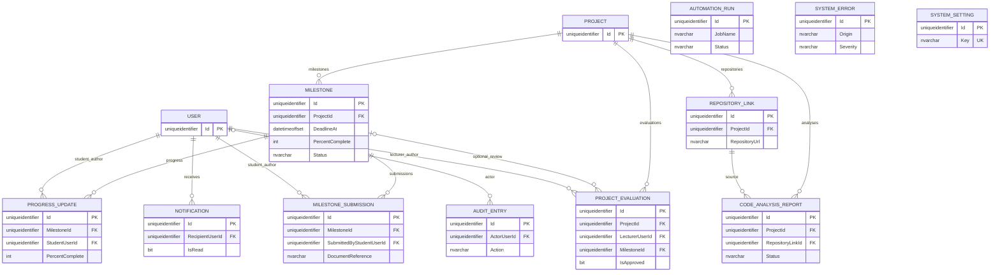

# Week 3 | ERD đề xuất (SQL Server / EF Core)

**Trạng thái:** bản thiết kế v0.2 để rà soát. Chưa tạo database, migration hoặc dữ liệu giả. Sơ đồ được chia làm hai phần để dễ đọc; cùng một `USER` / `PROJECT` là cùng bảng.

## A. Tài khoản, đăng ký, phân công và dự án

**Ghi chú:** các quan hệ `USER` tới `LECTURER_REQUEST` và `PROJECT` tương ứng hai FK độc lập (StudentUserId/LecturerUserId), rút gọn thành một đường trong hình để giảm nhiễu. Chính xác từng cặp FK nằm trong `StudentProjectsDbContext.cs`.

## B. Theo dõi tiến độ, đánh giá, tích hợp và vận hành

`AUTOMATION_RUN`, `SYSTEM_ERROR`, `SYSTEM_SETTING` là các bảng vận hành độc lập, không có FK ở bản thiết kế hiện tại. Tất cả các entity kế thừa `Id`, `CreatedAt`, `UpdatedAt` từ `Entity`; sơ đồ lược bớt hai trường thời gian để dễ đọc.

## Cardinality và ràng buộc đã đề xuất

- `User` 1–0..1 `StudentProfile` / `LecturerProfile` (unique `UserId`, nhưng quyền/role phải kiểm tra tại application).
- `LecturerCapacity` là một bản ghi / (`LecturerUserId`, `RegistrationPeriodId`), unique composite, `0 <= CurrentStudents <= MaxStudents`, có `RowVersion`.
- `Project.AcceptedLecturerRequestId` có thể null khi dự án còn DRAFT; khi được sử dụng, một LecturerRequest không được dùng cho hai Project (unique index).
- Tất cả FK cấu hình `NoAction` khi xóa để không làm mất nhật ký/tiến độ do cascade; chiến lược lưu trữ và xóa mềm sẽ quyết định sau.
- Deadline là `datetimeoffset`, `OVERDUE` là **trạng thái milestone**, không phải trạng thái Project. `REJECTED` chỉ cho Topic/Proposal hoặc request.
- Trạng thái `Topic` hiện đại diện cả Topic Proposal, không có bảng TopicProposal riêng.

Xem `docs/DATABASE-DESIGN.md` cho các quyết định còn chờ chốt và những gì **chưa được kiểm tra bằng runtime**.
